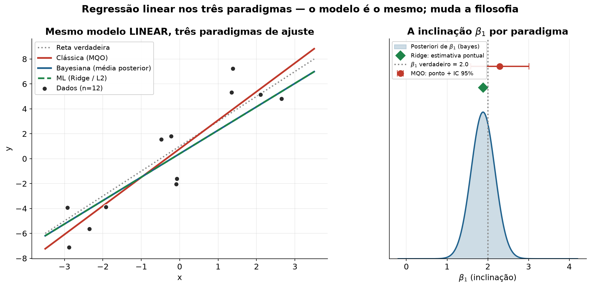

# Regressão linear sob três paradigmas: clássico, bayesiano e machine learning

Ajusta o **mesmo modelo linear** (`y = β₀ + β₁·x`) de três formas diferentes e mostra
que o que muda não é o modelo, e sim a *filosofia de inferência*:

| Paradigma | Estimador | O que entrega |
|---|---|---|
| **Clássico (MQO)** | Mínimos quadrados / máxima verossimilhança | Estimativa pontual + intervalo de confiança |
| **Bayesiano** | Priori Gaussiana conjugada → média a posteriori | Distribuição a posteriori completa |
| **Machine Learning** | Regressão Ridge (penalização L2) | Estimativa pontual regularizada |

## O resultado teórico ilustrado

A regressão **Ridge** é o estimador de **máximo a posteriori (MAP)** de uma regressão
bayesiana com priori Gaussiana. Como, no caso Gaussiano, a posteriori é simétrica
(média = moda), os coeficientes de **Bayes e Ridge coincidem exatamente**. A
correspondência dos hiperparâmetros é:

```
λ (Ridge)  =  σ² / τ²   =   variância do ruído / variância da priori
```

Saída do script (dados sintéticos, `seed = 11`):

```
Coeficientes (intercepto, inclinação):
  MQO   : 0.794, 2.294
  Bayes : 0.398, 1.882
  Ridge : 0.398, 1.882
```

O MQO não encolhe (maior variância); Ridge e Bayes aplicam *shrinkage* rumo a zero.



## Como rodar

```bash
pip install -r requirements.txt
python regressao_tres_paradigmas.py
```

Gera a figura `regressao_tres_paradigmas.png` na pasta atual.

## Licença

MIT
